# Codes PlantUML pour les Diagrammes SkillSync

Ce fichier contient tous les codes PlantUML nécessaires pour générer les diagrammes du rapport.
Utilisez https://www.plantuml.com/plantuml/ pour générer les images PNG.

---

## 1. Diagramme de Cas d'Utilisation Global

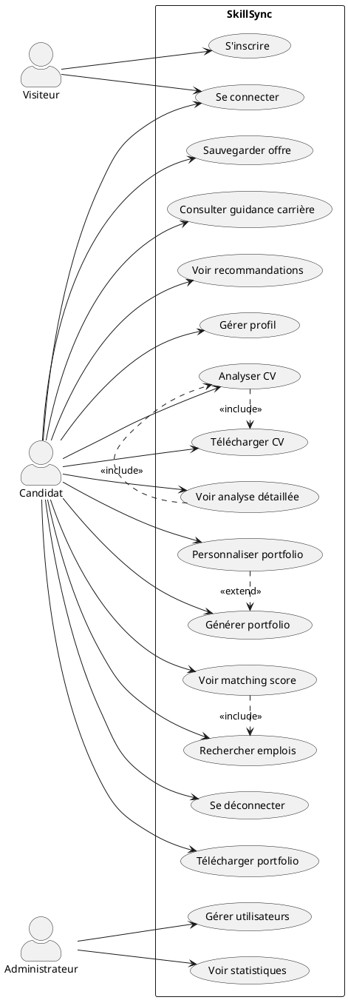

Fichier de sortie: `img/use_case_global.png`

---

## 2. Diagramme de Classes Global

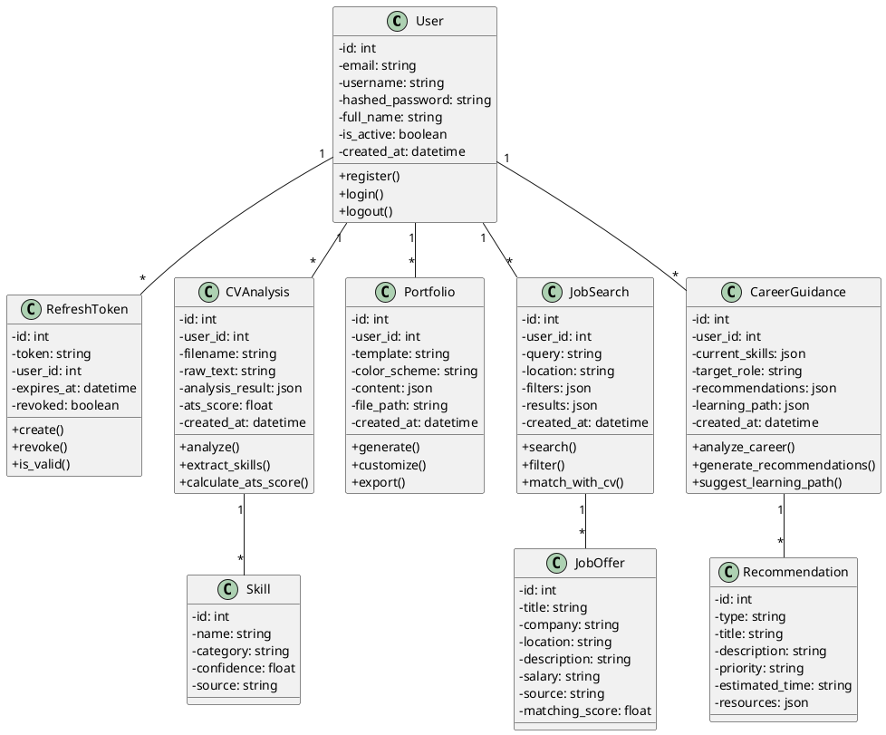

Fichier de sortie: `img/class_diagram_global.png`

---

## 3. Diagramme de Séquence - Connexion

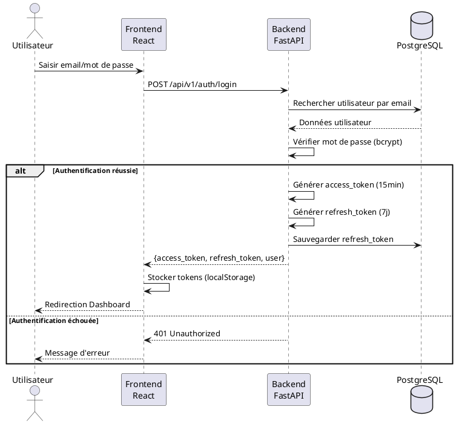

Fichier de sortie: `img/sequence_login.png`

---

## 4. Diagramme de Séquence - Analyse CV

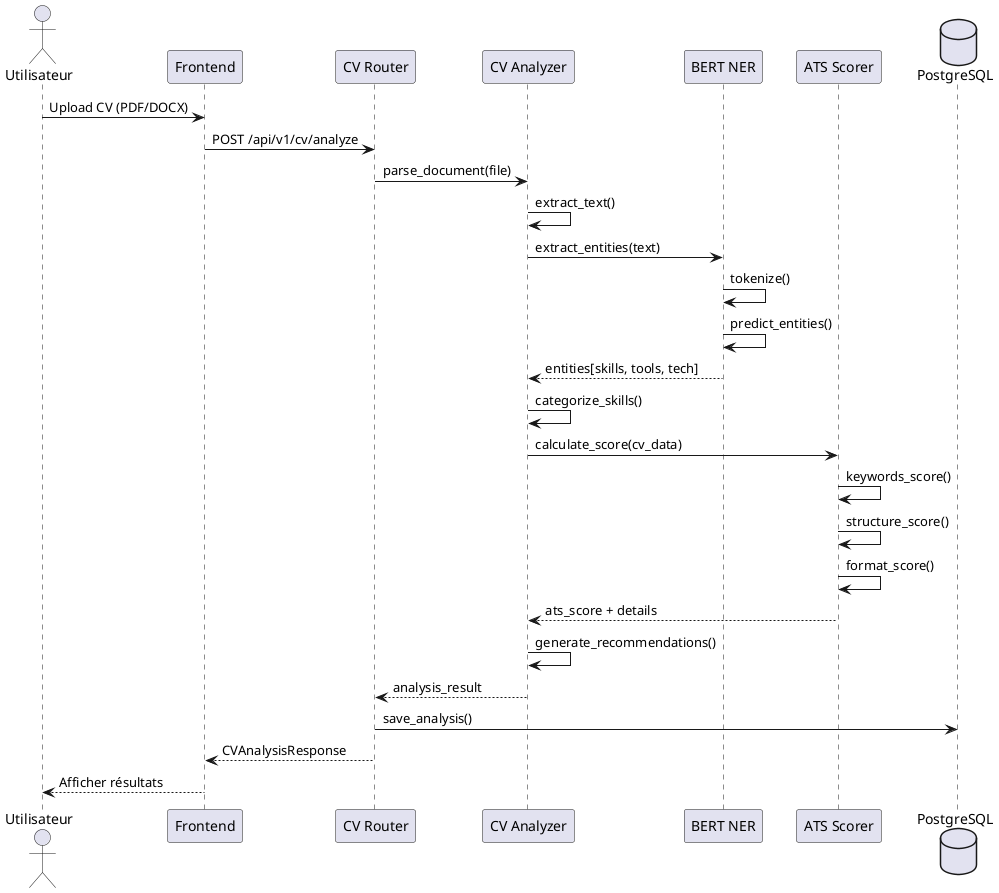

Fichier de sortie: `img/sequence_cv_analysis.png`

---

## 5. Diagramme de Séquence - Génération Portfolio

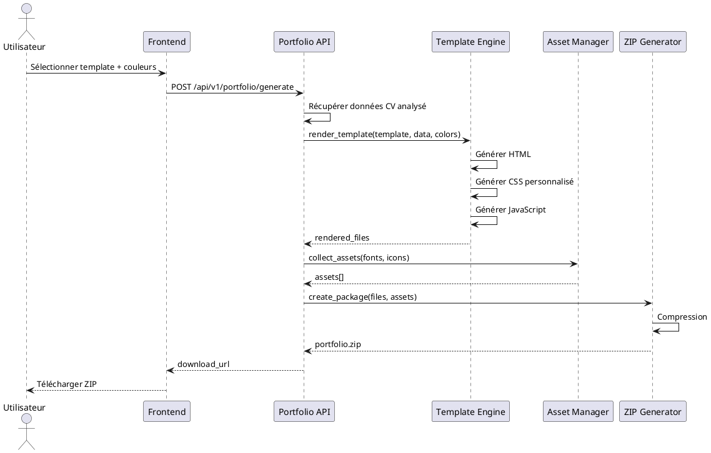

Fichier de sortie: `img/sequence_portfolio.png`

---

## 6. Diagramme de Séquence - Matching CV-Offre

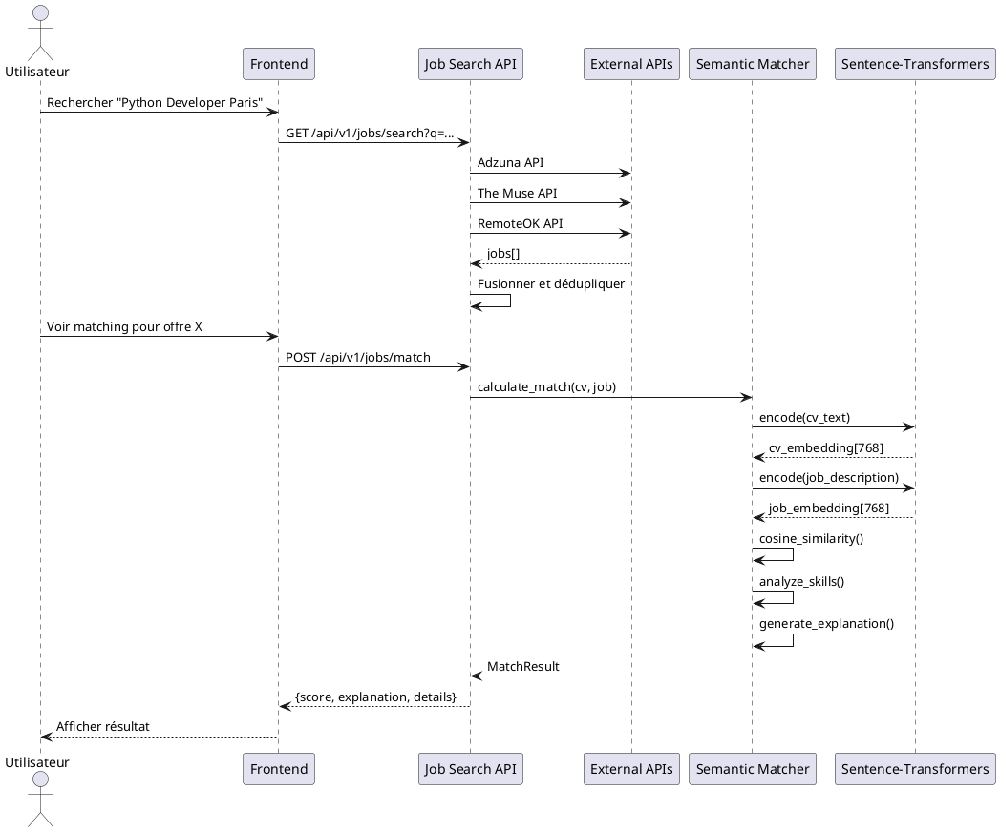

Fichier de sortie: `img/sequence_matching.png`

---

## 7. Diagramme de Séquence - Guidance Carrière

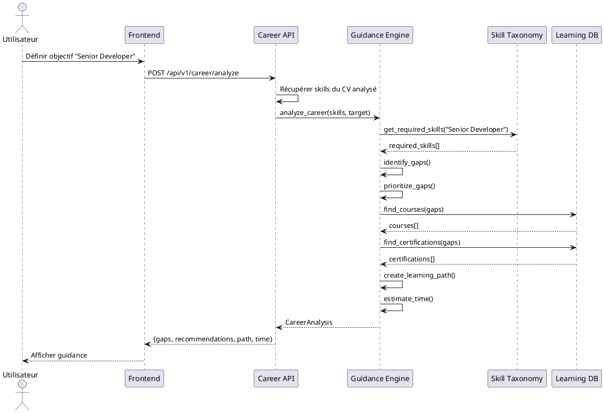

Fichier de sortie: `img/sequence_career.png`

---

## 8. Diagramme d'Architecture Technique

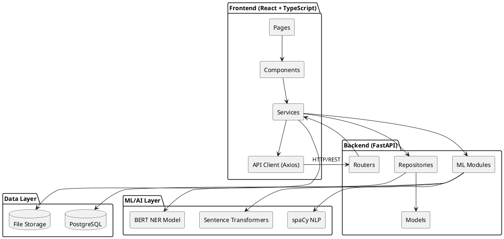

Fichier de sortie: `img/architecture.png`

---

## 9. Diagramme de Cas d'Utilisation - Authentification

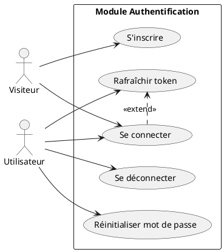

Fichier de sortie: `img/usecase_auth.png`

---

## 10. Diagramme de Cas d'Utilisation - Analyse CV

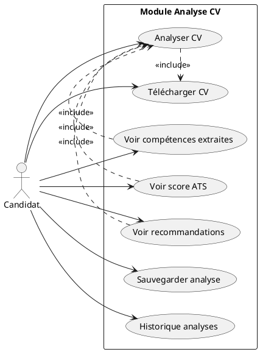

Fichier de sortie: `img/usecase_cv.png`

---

## 11. Diagramme de Classes - Module Auth

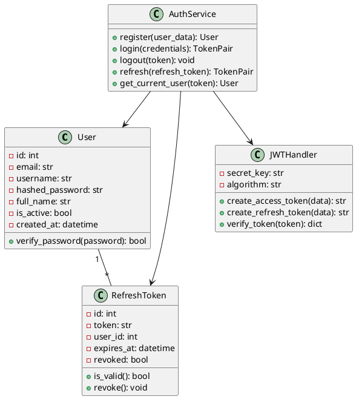

Fichier de sortie: `img/class_auth.png`

---

## 12. Diagramme de Gantt - Planification

```plantuml
@startgantt
project starts 2024-09-01

[Sprint 1: Auth] starts 2024-09-01 and lasts 14 days
[Sprint 2: CV Analysis] starts after [Sprint 1: Auth] and lasts 14 days
[Sprint 3: Portfolio] starts after [Sprint 2: CV Analysis] and lasts 14 days
[Sprint 4: Job Matching] starts after [Sprint 3: Portfolio] and lasts 14 days
[Sprint 5: Career Guidance] starts after [Sprint 4: Job Matching] and lasts 14 days
[Sprint 6: Dashboard] starts after [Sprint 5: Career Guidance] and lasts 14 days

[Release 1] happens at [Sprint 2: CV Analysis]'s end
[Release 2] happens at [Sprint 4: Job Matching]'s end
[Release 3] happens at [Sprint 6: Dashboard]'s end
@endgantt
```

Fichier de sortie: `img/gantt.png`

---

## Instructions de génération

1. Allez sur https://www.plantuml.com/plantuml/
2. Collez chaque code PlantUML
3. Téléchargez l'image PNG
4. Renommez selon le nom de fichier indiqué
5. Placez dans le dossier `img/` du rapport

